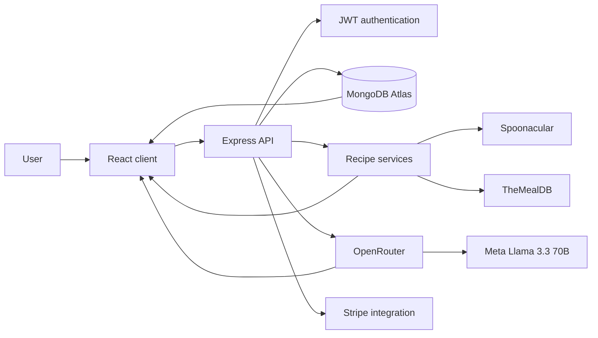

# Cook Meal Planner

Cook is a full-stack meal-planning platform for building a complete weekly food plan. It combines account-based personalization, recipe discovery, an AI planning assistant, daily nutrition summaries, and a responsive dashboard in one application.

The project is designed as a real production-style system. The React client communicates with a protected Express API, MongoDB stores user and planning data, external recipe providers supply meal ideas, and Meta Llama 3.3 70B powers structured nutrition and meal-plan generation.

**Live application:** [cook.monishpatalay.dev](https://cook.monishpatalay.dev)

## What Cook does

Cook helps a user move from “What should I eat?” to a clear seven-day plan.

- Creates an account with a unique username and password
- Collects age, weight, height, and optional dietary preferences during onboarding
- Searches recipes from Spoonacular and TheMealDB
- Adds a recipe to a specific day and meal slot
- Organizes every day into breakfast, lunch, and dinner
- Calculates a nutrition summary for every day
- Shows calorie progress through an interactive circular indicator
- Displays protein, carbohydrates, fat, fiber, sugar, and sodium totals
- Recalculates nutrition automatically after meals are added or removed
- Lets users chat with Milo, the AI meal-planning assistant
- Generates a structured seven-day plan with three meals per day
- Allows the user to review, select, regenerate, revise, clear, or approve an AI draft
- Adds AI meals only after explicit user approval
- Supports mobile day accordions so the weekly plan stays compact on small screens
- Includes profile, preferences, subscription, custom-meal, and account views

## How the application works



The browser never calls recipe, AI, database, or billing services directly. All external requests pass through the Express backend, which keeps credentials server-side and returns normalized application data to the React client.

## Main user flows

### 1. Account and planning profile

Registration is a two-step experience:

1. The user chooses a username and password.
2. The user adds a planning profile with age, weight, weight unit, height, and dietary preferences.
3. The backend validates the values and hashes the password with bcrypt.
4. MongoDB creates the user document.
5. The API returns a signed JWT and the client opens the authenticated application.

The profile supports kilograms or pounds for weight and feet plus inches for height. These values are used to create a personalized daily nutrition reference.

### 2. Recipe discovery and meal-plan creation

1. The user searches for a meal.
2. The backend queries TheMealDB and Spoonacular concurrently.
3. Provider responses are converted to one shared recipe format.
4. Results are deduplicated and returned to the search page.
5. The user selects **Add to Meal Plan**.
6. The user chooses Monday through Sunday.
7. The user chooses breakfast, lunch, or dinner.
8. The backend appends the meal to the authenticated user’s weekly plan.
9. The dashboard groups the saved meals by day and slot.

Every saved meal has its own entry identifier, which allows duplicate recipes to be handled correctly and removed independently.

### 3. Daily nutrition summary

1. The dashboard requests the weekly nutrition summary.
2. The backend creates a stable lookup key for every saved meal.
3. Existing nutrition estimates are loaded from MongoDB.
4. Missing estimates are generated together through OpenRouter.
5. Results are validated, normalized, cached, and grouped by day.
6. Daily totals are compared with the user’s planning reference.
7. The UI renders a circular calorie indicator for each day.
8. Clicking the circle opens the full nutrient breakdown.

Removing a meal updates the stored meal plan and immediately requests a fresh daily total.

### 4. Milo AI meal planner

Milo is an approval-based AI planning workflow:

1. The user describes goals, schedule, budget, foods, or dietary preferences.
2. Milo uses existing dietary preferences and the conversation as planning context.
3. Milo can ask up to three focused follow-up questions when more information is useful.
4. The AI returns a schema-validated seven-day plan.
5. Every day contains breakfast, lunch, and dinner.
6. The draft is saved separately from the active meal plan.
7. The user reviews individual meal slots and selects which ones to keep.
8. The user can revise or regenerate the complete draft.
9. The user approves selected meals.
10. Only the approved slots are written into the weekly meal plan.

Milo drafts have their own lifecycle and status values, preventing the same draft from being approved twice. Drafts can also be cleared directly from the assistant interface.

## Recipe platform

Cook uses a provider-aware recipe service instead of connecting the UI to one source.

### Spoonacular

Spoonacular provides complex recipe search and dietary filtering. A user’s selected dietary preference is included when the backend builds the provider request.

### TheMealDB

TheMealDB support covers the standard V1 recipe workflows:

- Search by meal name
- Search by first letter
- Look up a complete recipe by meal ID
- Load a random recipe
- Load categories
- List categories, areas, and ingredients
- Filter by one ingredient, category, or area
- Normalize instructions, ingredients, measurements, tags, source links, and video links

### Provider orchestration

The recipe service runs available provider requests with `Promise.allSettled`. Successful results are combined even if another provider does not respond. Every returned meal includes a provider source so caching and saved meal records remain unambiguous.

## Nutrition system

Nutrition is estimated for one typical serving and stored in a reusable cache.

The structured nutrition record contains:

- Serving description
- Calories
- Protein in grams
- Carbohydrates in grams
- Fat in grams
- Fiber in grams
- Sugar in grams
- Sodium in milligrams
- Confidence level
- Human-readable summary
- AI model name
- Provider-aware lookup key
- Creation and update timestamps

Cook supports both a single-meal estimate and a batch estimation flow for daily totals. Batch estimation reduces repeated AI calls when several uncached meals appear in the same weekly plan.

The daily reference uses the planning profile to calculate a calorie target and related macro references. The application converts pounds to kilograms when needed, converts height to centimeters, and derives calorie, protein, carbohydrate, fat, fiber, and sodium reference values. The resulting progress state is rendered as empty, building, on track, or over reference.

When an external estimate is unavailable, Cook can produce a logic-based temporary estimate from the meal type and any supplied calorie information. This keeps the daily summary data shape stable across the application.

## Technical stack

| Area | Technology | Purpose |
| --- | --- | --- |
| Frontend | React 19 | Component-based application UI |
| Language | TypeScript 6 | Typed frontend data and component contracts |
| Build tool | Vite 8 | Development server and production bundling |
| Styling | Tailwind CSS 4 | Responsive utility-first styling |
| Components | shadcn/ui and Radix UI | Accessible interactive primitives |
| Motion | Motion, GSAP, CSS animations | Page, card, and interaction animations |
| Icons | Lucide React | Consistent interface iconography |
| Notifications | Sonner | Success and error feedback |
| Backend | Node.js and Express 4 | REST API and server-side integrations |
| Database | MongoDB Atlas | Persistent account, meal, draft, and nutrition data |
| ODM | Mongoose 9 | Schemas, indexes, validation, and queries |
| Authentication | bcryptjs and JSON Web Tokens | Password hashing and signed sessions |
| AI SDK | Vercel AI SDK | Structured Milo plan generation |
| AI provider | OpenRouter | Server-side LLM gateway |
| AI model | Meta Llama 3.3 70B Instruct | Meal planning and nutrition estimates |
| Validation | Zod and JSON Schema | Structured AI output validation |
| Recipe APIs | Spoonacular and TheMealDB | Recipe search and discovery |
| Billing | Stripe SDK | Checkout, customer portal, and webhook foundation |
| Security | Helmet and express-rate-limit | HTTP protection and request limiting |
| Deployment | Vercel | Static React hosting and Node.js Functions |
| CI | GitHub Actions | Automated linting, syntax checks, and builds |

## Application architecture

### Frontend

The frontend is a React single-page application using React Router. Protected routes are rendered inside the main application shell, while login and registration use a separate authentication layout.

Important frontend areas include:

- `auth-context.tsx` manages the authenticated user and session state.
- `api.ts` provides typed methods for every backend request.
- `dashboard-page.tsx` loads weekly plans and daily nutrition totals.
- `search-page.tsx` handles multi-provider recipe discovery.
- `planner-page.tsx` contains Milo and the custom-meal workspace.
- `day-column.tsx` renders a day, three meal sections, mobile expansion, and nutrition progress.
- `daily-nutrition-dialog.tsx` displays the full daily nutrient breakdown.
- `milo-assistant.tsx` controls the AI conversation and draft lifecycle.
- `milo-plan-review.tsx` handles slot-level selection and approval.

The Vite development server proxies `/api` to Express on port `3001`. In production, Vercel serves the built client and rewrites API traffic to the Node.js Function.

### Backend

The Express application is reusable in two environments:

- `app.js` starts the local Node.js server.
- `api/index.js` exports the same Express app as a Vercel Function.

The backend is organized into:

- **Routes** for HTTP request validation and responses
- **Middleware** for authentication and async error handling
- **Services** for recipe providers, AI generation, nutrition aggregation, billing, and feature access
- **Models** for persistent MongoDB documents

MongoDB connection state is reused across serverless requests so warm Vercel Function instances do not create an unnecessary new connection for every API call.

## Data model

| Collection | Main data |
| --- | --- |
| `users` | Username, password hash, dietary preferences, age, weight, height, subscription state, timestamps |
| `mealplans` | User reference, week number, and embedded meal entries for day and meal type |
| `nutritionestimates` | Provider-aware lookup key, serving assumptions, nutrients, confidence, model, timestamps |
| `milodrafts` | User reference, diets, structured seven-day plan, model, approval status, expiry, approval time |

### Meal entry structure

Each meal-plan entry stores:

- Unique entry ID
- Provider meal ID
- Provider source
- Name and image
- Day of the week
- Meal type
- Dietary tags
- Description
- Ingredient list
- Estimated calories

This format supports Spoonacular meals, TheMealDB meals, user-created meals, and AI-generated meals in the same weekly plan.

## API overview

All recipe, planning, nutrition, profile, meal-plan, and subscription APIs run under `/api`.

### Users

| Method | Route | Purpose |
| --- | --- | --- |
| `POST` | `/api/users/register` | Create an account and planning profile |
| `POST` | `/api/users/login` | Verify credentials and issue a JWT |
| `GET` | `/api/users/:id` | Load the authenticated user profile |
| `PUT` | `/api/users/:id/preferences` | Update dietary preferences |

### Meals and recipes

| Method | Route | Purpose |
| --- | --- | --- |
| `GET` | `/api/meals/search` | Search normalized Spoonacular and TheMealDB results |
| `POST` | `/api/meals/nutrition` | Get or create a cached nutrition estimate |
| `GET` | `/api/meals/themealdb/first-letter` | Search TheMealDB by first letter |
| `GET` | `/api/meals/themealdb/random` | Load a random detailed recipe |
| `GET` | `/api/meals/themealdb/categories` | Load recipe categories |
| `GET` | `/api/meals/themealdb/list/:type` | List categories, areas, or ingredients |
| `GET` | `/api/meals/themealdb/filter` | Filter recipes by a supported value |
| `GET` | `/api/meals/themealdb/lookup/:mealId` | Load one complete recipe |

### Meal plans

| Method | Route | Purpose |
| --- | --- | --- |
| `GET` | `/api/mealplans/:userId` | Load a user’s weekly plans |
| `GET` | `/api/mealplans/nutrition-summary/:userId` | Calculate daily totals and progress |
| `POST` | `/api/mealplans` | Add a recipe to a day and meal slot |
| `DELETE` | `/api/mealplans/:id` | Delete a meal plan |
| `DELETE` | `/api/mealplans/:id/meals/by-entry/:entryId` | Remove one exact meal entry |
| `DELETE` | `/api/mealplans/:id/meals/:mealId` | Remove a stored recipe by meal ID |

### Milo and custom planning

| Method | Route | Purpose |
| --- | --- | --- |
| `POST` | `/api/planner/milo/chat` | Chat, revise, or regenerate a Milo draft |
| `POST` | `/api/planner/milo/:draftId/approve` | Add selected draft slots to the meal plan |
| `DELETE` | `/api/planner/milo/:draftId` | Clear a pending Milo draft |
| `POST` | `/api/planner/generate` | Generate a structured weekly plan |
| `POST` | `/api/planner/approve` | Approve selected generated meals |
| `POST` | `/api/planner/custom-meal` | Add a user-defined meal |

### Subscriptions

| Method | Route | Purpose |
| --- | --- | --- |
| `POST` | `/api/subscriptions/checkout` | Create a Stripe Checkout session |
| `POST` | `/api/subscriptions/portal` | Open the Stripe customer portal |
| `GET` | `/api/subscriptions/status/:userId` | Load subscription access state |
| `POST` | `/api/subscriptions/webhook` | Process signed Stripe subscription events |

## Authentication and security

Cook applies security at the HTTP, account, route, and provider layers.

- Passwords are hashed with bcrypt before MongoDB storage.
- JWTs include a dedicated issuer and audience.
- Protected requests use the `Authorization: Bearer <token>` header.
- Ownership middleware prevents one account from loading another account’s resources.
- User identifiers in protected mutations are derived from the verified token.
- Authentication endpoints are rate limited.
- Milo requests are rate limited.
- New nutrition estimate requests are rate limited and cached.
- Helmet sets secure Express response headers.
- Vercel adds HSTS, frame protection, content-type protection, referrer policy, and permissions policy headers.
- Express JSON request bodies are limited to `100kb`.
- Stripe webhooks use the original raw request body for signature verification.
- AI prompts treat user text and meal names as untrusted data.
- Milo output is validated against Zod schemas before it can become a draft.
- Nutrition output is validated against a strict JSON schema before storage.
- External requests use timeouts and controlled error responses.
- API keys remain in server environment variables and are not included in the client bundle.

## Responsive UI and design system

The interface uses a health-focused white and green visual system with reusable tokens for surfaces, borders, typography, status colors, spacing, shadows, and motion.

The layout adapts across phone, tablet, laptop, and wide desktop sizes:

- Weekly cards form a seven-column grid on wide displays.
- Cards reorganize into smaller grids at intermediate sizes.
- Mobile days become expandable accordions.
- Breakfast, lunch, and dinner remain visually separated.
- Dialogs provide focused meal assignment and nutrition details.
- Skeletons, toast messages, empty states, loading states, and optimistic removal improve feedback.
- Interactive controls include labels, focus states, keyboard support, and accessible descriptions.

## Project structure

```text
.
├── .github/workflows/ci.yml       # GitHub Actions quality workflow
├── api/index.js                   # Vercel Function entry point
├── db/
│   ├── connection.js              # Reusable MongoDB connection
│   └── models/                    # User, MealPlan, NutritionEstimate, MiloDraft
├── frontend/
│   ├── public/                    # Static assets
│   ├── src/components/            # Layout, meal, Milo, AI, and UI components
│   ├── src/context/               # Authentication state
│   ├── src/lib/                   # API client and shared helpers
│   ├── src/pages/                 # Application pages
│   └── vite.config.ts             # Vite, Tailwind, aliases, and API proxy
├── server/
│   ├── middleware/                # Authentication and async handlers
│   ├── routes/                    # REST API route groups
│   └── services/                  # AI, recipes, nutrition, access, and Stripe
├── app.js                         # Express app and local server
├── vercel.json                    # Build, routing, Functions, and headers
├── .env.example                   # Environment variable template
├── DEPLOY.md                      # Deployment workflow
├── SECURITY.md                    # Security policy
└── CONTRIBUTING.md                # Contribution workflow
```

## Local development

### Requirements

- Node.js `20.19+` or `22.12+`
- npm
- MongoDB database
- OpenRouter API key
- Spoonacular API key
- TheMealDB API configuration

### Setup

1. Clone the repository:

   ```bash
   git clone https://github.com/monishpatalay/Meal-Planner-AI-App.git
   cd Meal-Planner-AI-App
   ```

2. Install backend dependencies:

   ```bash
   npm ci
   ```

3. Install frontend dependencies:

   ```bash
   npm ci --prefix frontend
   ```

4. Create the environment file:

   ```bash
   cp .env.example .env
   ```

5. Add the required values to `.env`.

6. Start the complete development environment:

   ```bash
   npm run dev
   ```

The React client runs at `http://localhost:5173`. Express runs at `http://localhost:3001`, and Vite forwards `/api` requests to Express.

## Environment variables

| Variable | Purpose |
| --- | --- |
| `PORT` | Local Express port |
| `MONGODB_URI` | MongoDB connection string |
| `AUTH_SECRET` | Production JWT signing secret |
| `SPOONACULAR_API_KEY` | Spoonacular recipe search credential |
| `THEMEALDB_API_BASE_URL` | TheMealDB API root |
| `THEMEALDB_API_KEY` | TheMealDB V1 or supporter key |
| `OPENROUTER_API_KEY` | OpenRouter server credential |
| `OPENROUTER_MODEL` | AI model identifier |
| `APP_URL` | Public application URL used in provider metadata and redirects |
| `PLANNER_PLUS_AVAILABLE` | Controls subscription-aware planning features |
| `MILO_PREVIEW_AVAILABLE` | Controls Milo availability in production |
| `STRIPE_SECRET_KEY` | Stripe server credential |
| `STRIPE_WEBHOOK_SECRET` | Stripe webhook signing secret |
| `STRIPE_PLUS_PRICE_ID` | Stripe recurring price identifier |

Use `.env.example` as the configuration template. The real `.env` file is excluded from Git and must never be committed.

## Available commands

| Command | Description |
| --- | --- |
| `npm run dev` | Run Express and Vite together |
| `npm run dev:backend` | Run Express with nodemon |
| `npm run dev:frontend` | Run only the Vite client |
| `npm run check:backend` | Syntax-check backend JavaScript files |
| `npm run lint` | Lint the frontend with Oxlint |
| `npm run build:frontend` | Type-check and build the React client |
| `npm run check` | Run backend checks, frontend lint, and production build |
| `npm run build` | Install frontend packages and build for deployment |
| `npm start` | Start the production Express server |

## Deployment

The production application is deployed as one Vercel project:

- Vite builds the React application into `frontend/dist`.
- Vercel serves the frontend as static assets.
- `/api/*` requests are rewritten to `api/index.js`.
- `api/index.js` runs Express inside a Node.js Function.
- The Function connects to MongoDB Atlas and the configured external services.
- Client-side routes are rewritten to `index.html` for React Router.
- Production environment variables are stored in Vercel and encrypted at rest.

The full release workflow is documented in [DEPLOY.md](./DEPLOY.md).

## Quality checks and CI

Every pull request runs the GitHub Actions **Lint and build** workflow on Node.js 22.

The workflow:

1. Installs backend dependencies with `npm ci`.
2. Installs frontend dependencies with `npm ci --prefix frontend`.
3. Checks backend JavaScript syntax.
4. Lints the frontend.
5. Runs the TypeScript compiler.
6. Creates the Vite production build.

Run the same verification locally with:

```bash
npm run check
```

